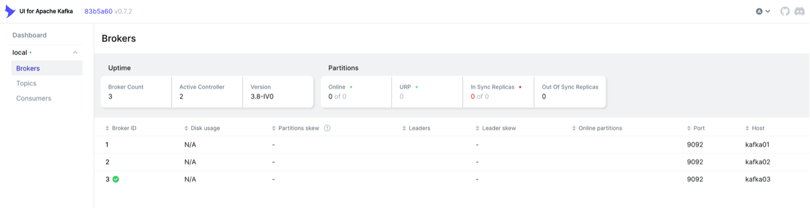
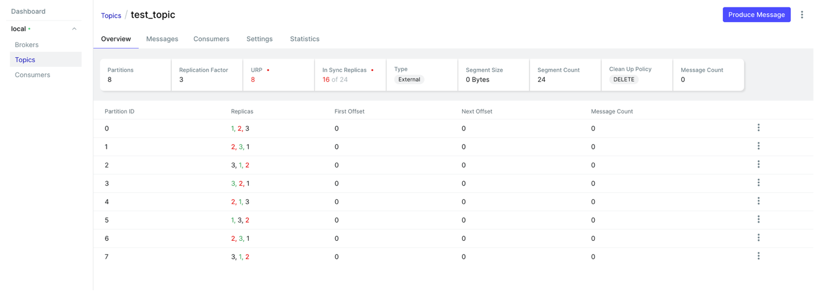
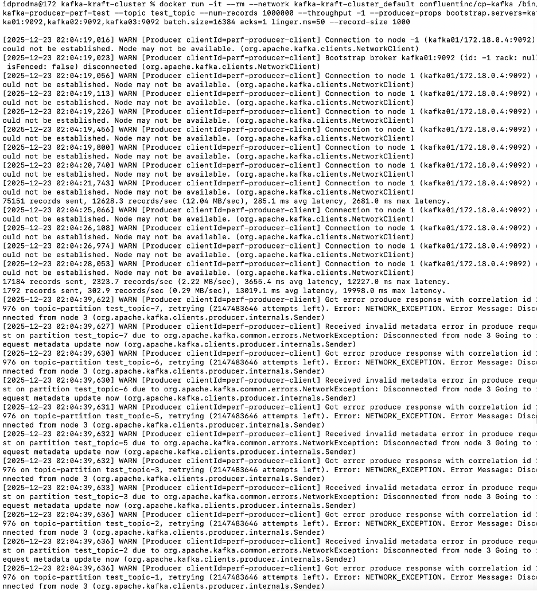
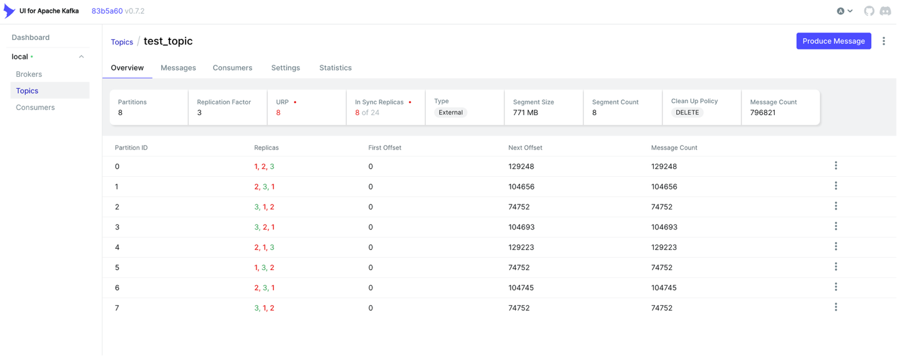
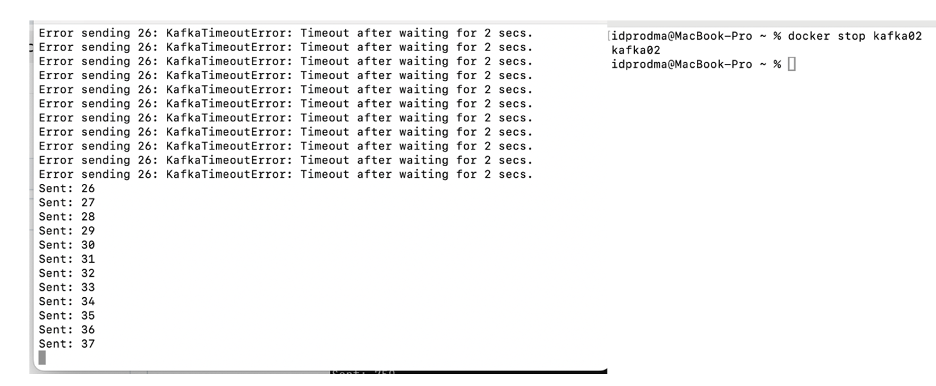
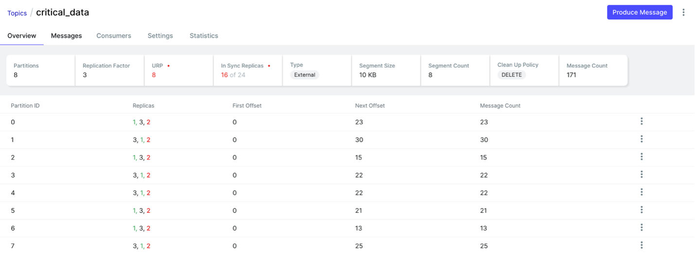
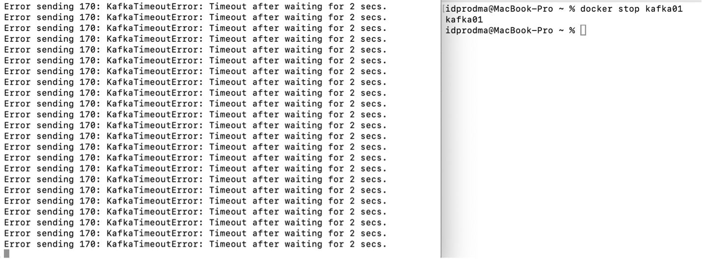
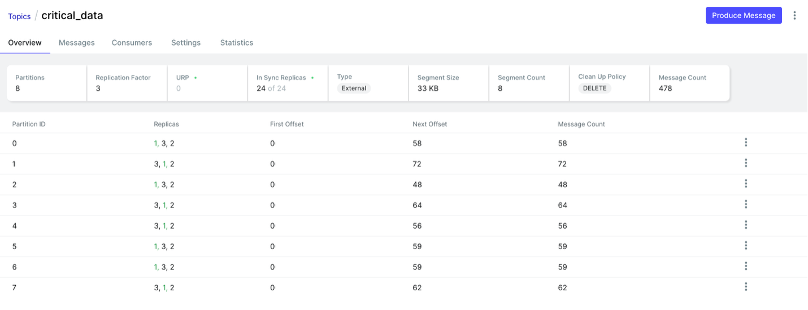

# Решение домашнего задания №2
*автор*: Продьма Илья Дмитриевич МКС244

## Начальное состояние
Состояние узлов:

Топик test_topic:

### Характеристики:
1. Партиции:
8 партиций распределяют данные топика по нескольким брокерам и
обеспечивают параллельную обработку данных несколькими потребителями.
Чем больше партиций, тем больше потребителей смогут работать одновременно с одним топиком.

2. Репликация:
Каждая из партиций хранится в 3 экземплярах на разных брокерах.
Репликация способствует отказоустойчивости - если один из узлов отказал, то данные можно восстановить на других нодах.

3. ISR (синхронные реплики):
Задает количество синхронизируемых с лидирующим узлом реплик.
Общее количество реплик составляет 24 (8 партиций по 3 реплики).

## Нагрузочное тестирование

Запуск нагрузочного тестирования:

Состояние после НТ:

Топик test_topic после НТ:

Статистика:
- RPS: 2323.7 records/sec (2.22 MB/sec)
- Latency: 3655.4 ms avg

В моем эксперименте была какая-то проблема с тем, что узлы могли самопроизвольно заваливаться и рестартовать.
Судя по логам, в основном HTTP 405 (откуда взялось - не понял).

## Тестирование отказоустойчивости
Включение скрипта на Python:

Отключение ведущего узла kafka02, начинает валиться доставка сообщений:

Смена контроллера:

Состояние топика critical_data:

Отключение ведущего узла kafka01, возникают большие проблемы с обработкой:

Перестала грузиться панель топиков в UI:

Восстановление узлов с помощью команды `docker start kafka02` и `docker start kafka01`.
Нормализация загрузки UI, доставки сообщений.
Состояние после восстановления узлов:

