# Решение домашнего задания №3
*автор*: Продьма Илья Дмитриевич МКС244

## Вывод patronictl - статусы хостов
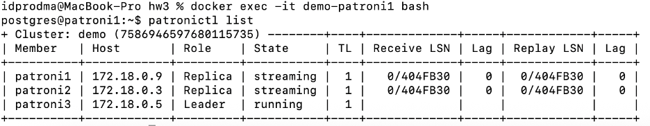

## Вывод haproxy на localhost:7001
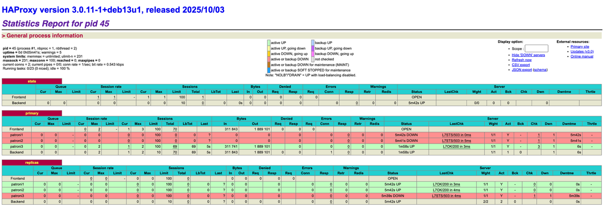

## Подключение к master-node БД и создание объектов
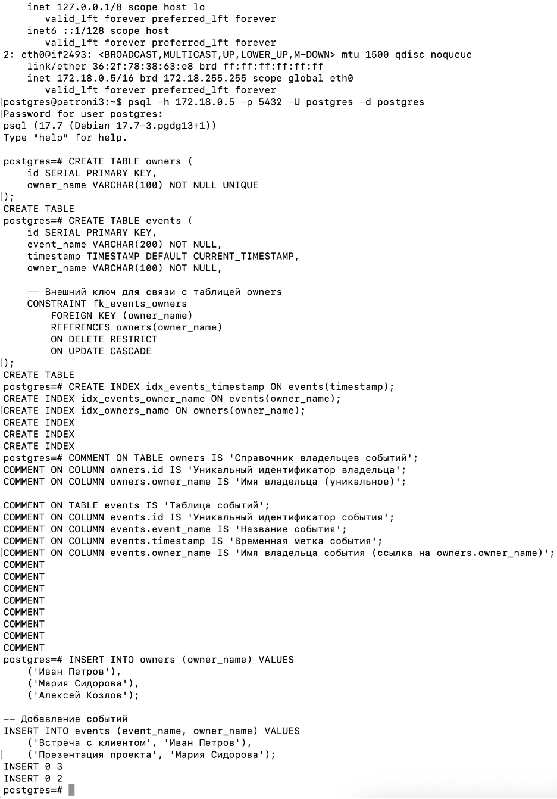

## Запуск генерации трафика
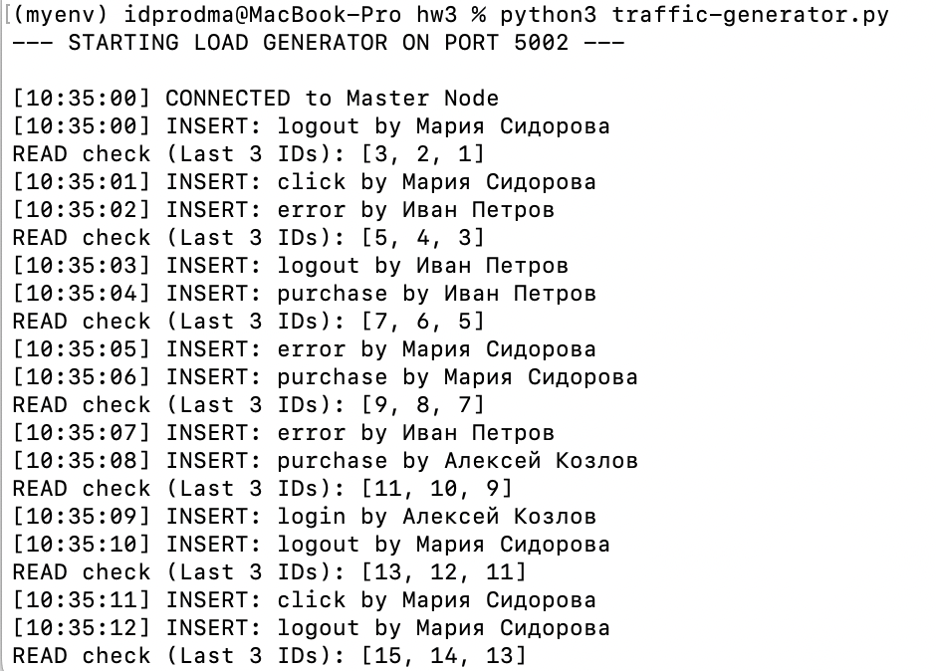

## Изменения в БД при генерации
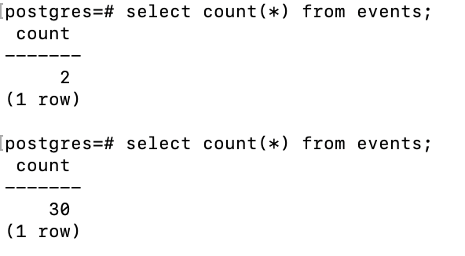

## Распределение трафика на хостах patroni

## Выключение лидера demo-patroni3
docker stop demo-patroni3
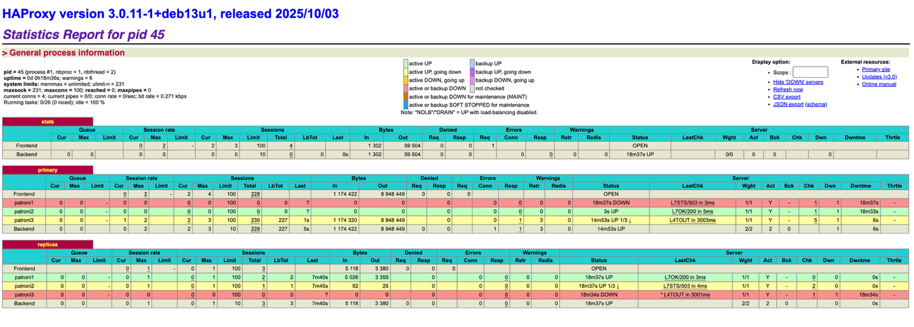

## Новое состояние хостов
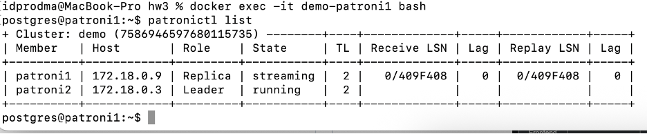

## Выключение реплики demo-patroni1
docker stop demo-patroni1
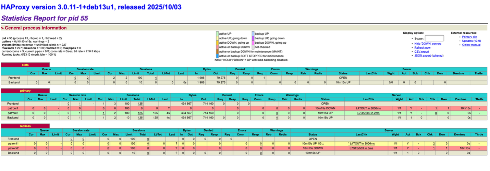

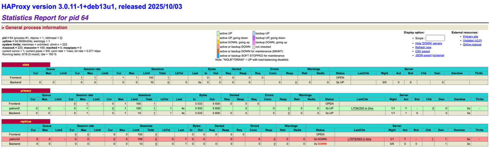

## Включение реплик demo-patroni1 и demo-patroni3
docker start demo-patroni1
docker start demo-patroni3

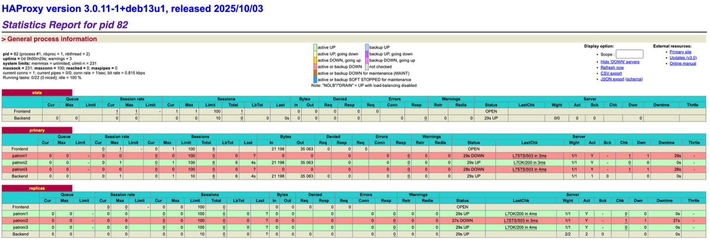

## Отключение etcd (лидер)
docker stop demo-etcd2
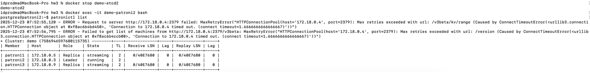

## Отключение etcd (реплика)
docker stop demo-etcd1
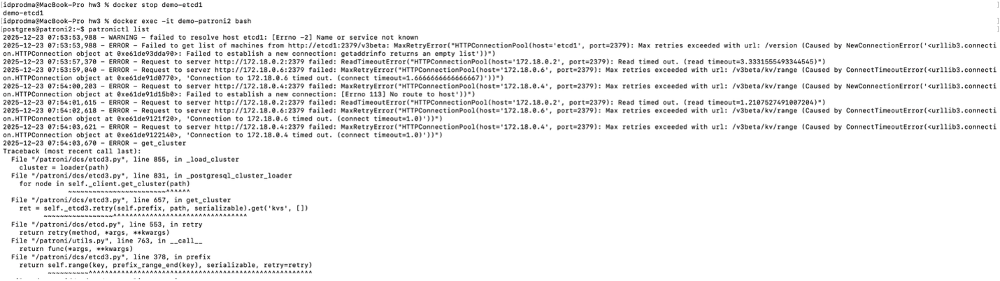

влияние на генерацию трафика:
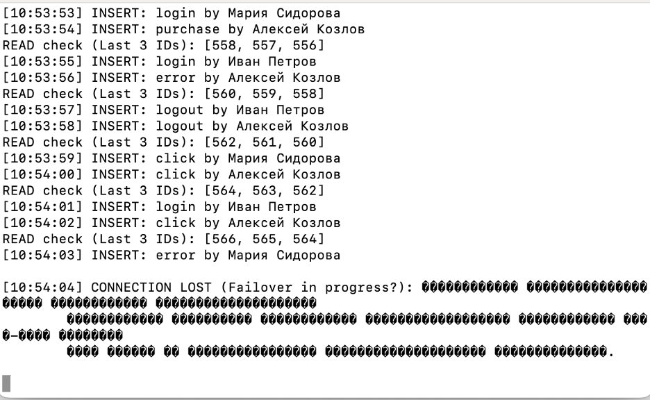

вывод haproxy:
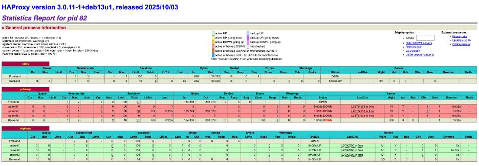

вывод patronictl после запуска etcd:
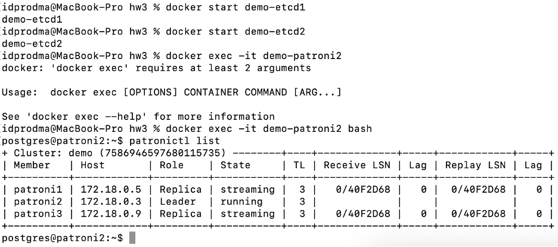

## Отключение haproxy
docker stop haproxy
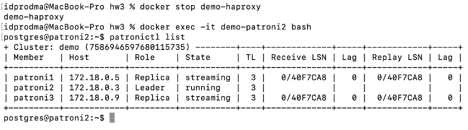

влияние на генерацию трафика:
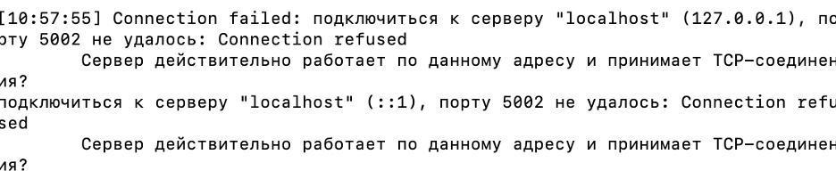

