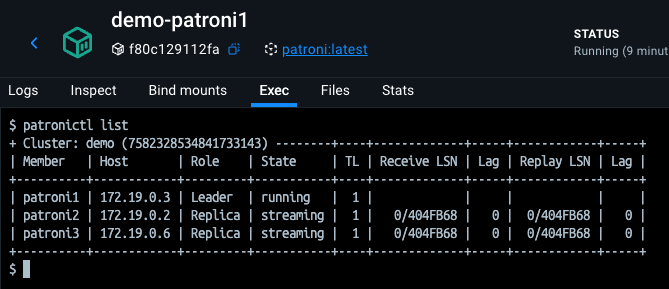
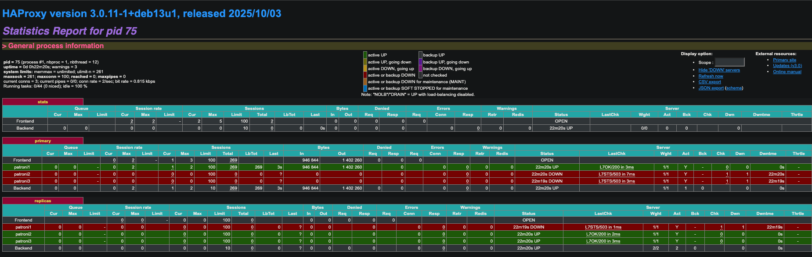
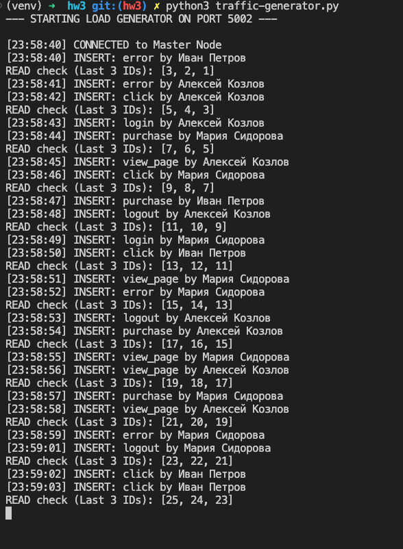
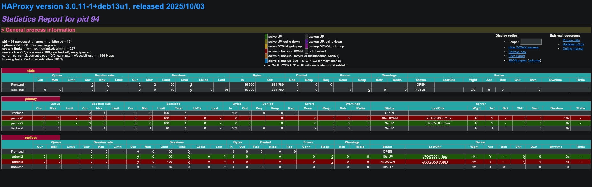
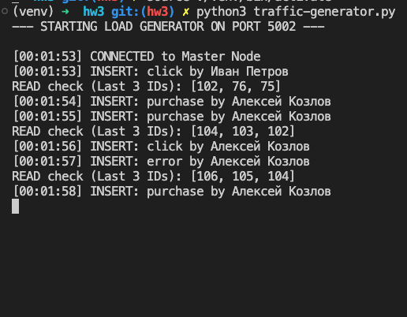
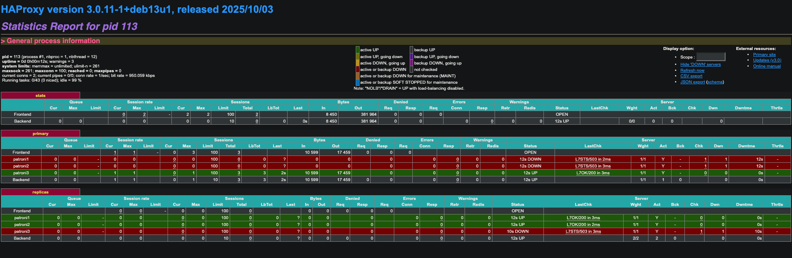
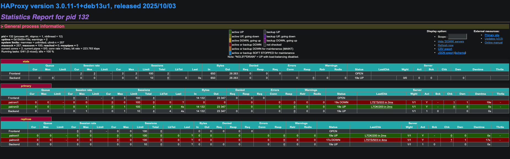
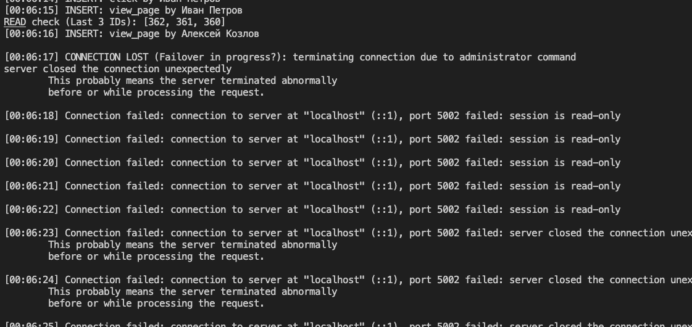
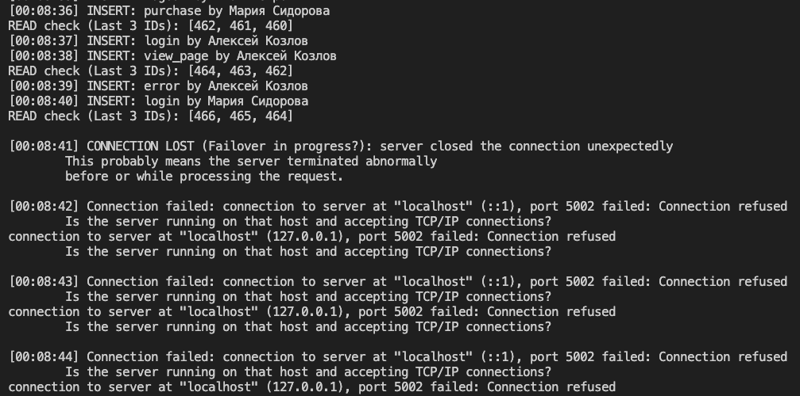

# HW 3 SOLUTION

## patronictl list

Cluster: demo

Member — узлы кластера: 

- patroni1 — Leader. Главный узел PostgreSQL. Принимает записывающие запросы (write). Реплики копируют данные с него.
- patroni2, patroni3 — Replicas. Работают в режиме streaming replication. Получают WAL-записи от лидера. Могут обрабатывать чтение (read-only), если настроен load balancing. Могут стать лидерами при отказе patroni1 (failover).

Role — Показывает распределение ролей: Leader — единственный мастер в кластере. Replica — горячее резервирование.

State — Статус PostgreSQL-инстанса: running — лидер работает нормально. streaming — реплики успешно читают WAL-поток от лидера.

Timeline — поколение данных в PostgreSQL. Если произойдёт failover, TL увеличится (1 → 2 → 3…), чтобы избежать конфликтов в истории WAL.

Receive LSN / Replay LSN. LSN — Log Sequence Number, позиция в WAL. Receive LSN — сколько данных реплика получила от лидера. Replay LSN — сколько данных реплика уже применила.

Lag — задержка

## Состояние HAProxy

Frontend работает корректно (OPEN) — нагрузка принимается без ошибок. В primary-пуле: patroni1 — UP → это текущий лидер PostgreSQL. patroni2 и patroni3 — DOWN → они помечены как реплики и не должны принимать запись (503 — EXPECTED). В replicas-пуле: Все три узла UP → реплики доступны для чтения. Трафик может распределяться между ними.

HAProxy корректно маршрутизирует запросы: Записи → на единственного лидера (patroni1). Чтение → на реплики (patroni2 и patroni3).

## Эксперименты

Идёт вставка данных

Стопаем patroni1. Видим, что происходит смена мастера, теперь мастер - patroni3. В процессе смены, данные перестают идти

К сожалению, у меня залип скрипт и не переподключился после потери соединения (но в следующих пунктах он нормально отрабатывал). Данные снова начали нормально вставляться.

Возврат patroni1 приводит к тому, что оно становится репликой

Стопаем patroni2 (реплику) и ничего не происходит, данные записываются, чтение работает (что очевидно, мы таким сетапом жили на позапрошлом шаге)

Выключаем etcd. Если выключить 1 штуку - никаких изменений нет. Но вот если 2 штуки - уходим в состояние, что все patroni становятся репликами. При потере кворума etcd (остался только 1 узел из 3) Patroni не может продлить лидерский lock и удостовериться в целостности состояния кластера. Поэтому лидер сбрасывает свои права и становится репликой, а остальные узлы также не могут стать лидерами. Это предотвращает split-brain и сохраняет согласованность данных.

Отключение haproxy - проблема. Достаточная ли у нас отказоустойчивость кластера? Как избежать в продакшен решении этого кейса? Приложение потеряет точку входа в кластер PostgreSQL. Сам кластер Patroni продолжит работать, но приложение не сможет к нему подключиться. Несмотря на то что Patroni-кластер из 3 узлов очень отказоустойчив, единственный HAProxy создаёт Single Point of Failure (SPOF).

Чтобы избежать SPOF, нужно сделать HAProxy высокодоступным. Обычно применяют один из вариантов:

1. Развернуть 2+ HAProxy и использовать keepalived + VRRP. Несколько HAProxy работают параллельно. Один активный, другие — резервные. При падении активного — IP автоматически переезжает на другой узел. Приложению ничего менять не нужно
2. Использовать балансировщик уровня Kubernetes (если всё в k8s)
3. Использовать облачный балансировщик 