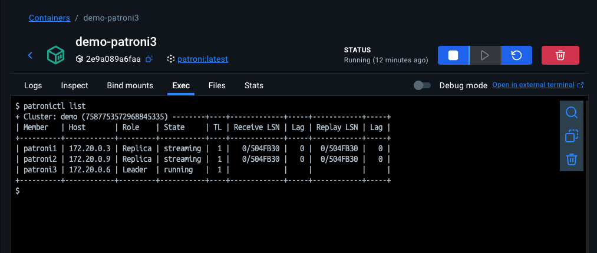
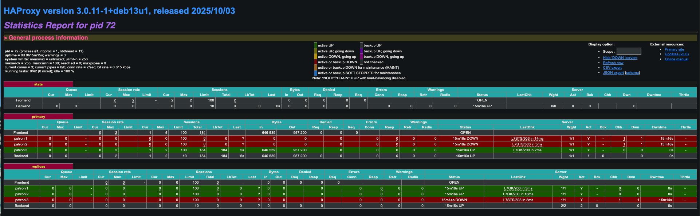
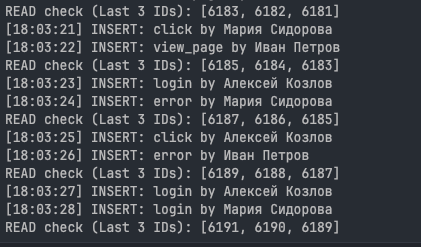
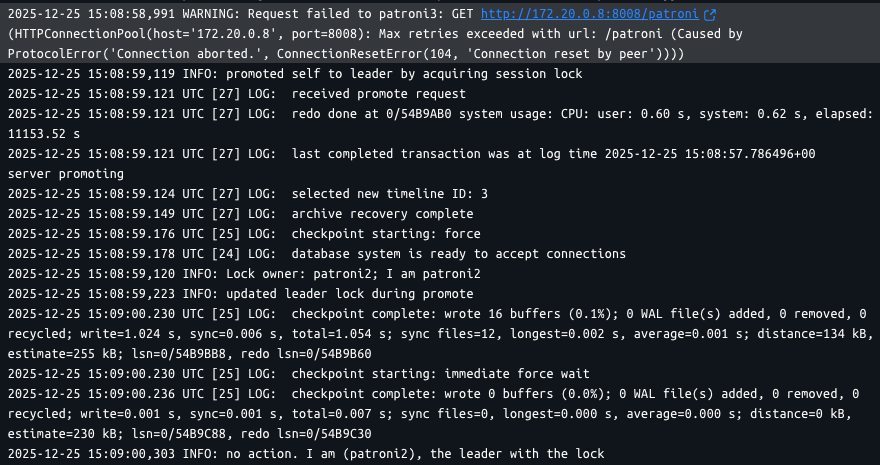
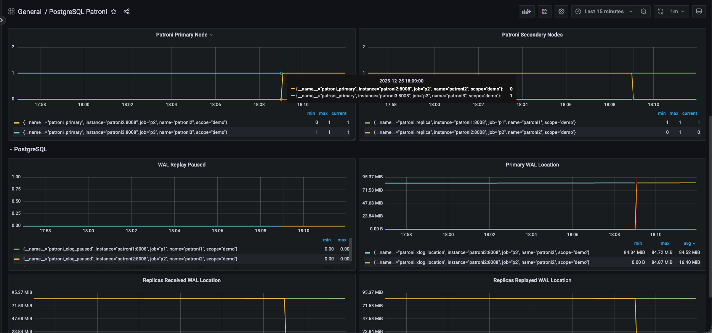
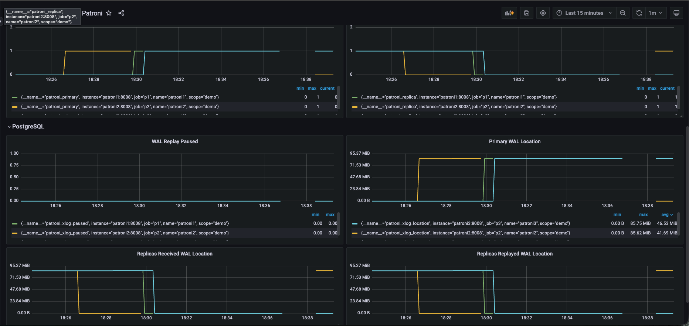
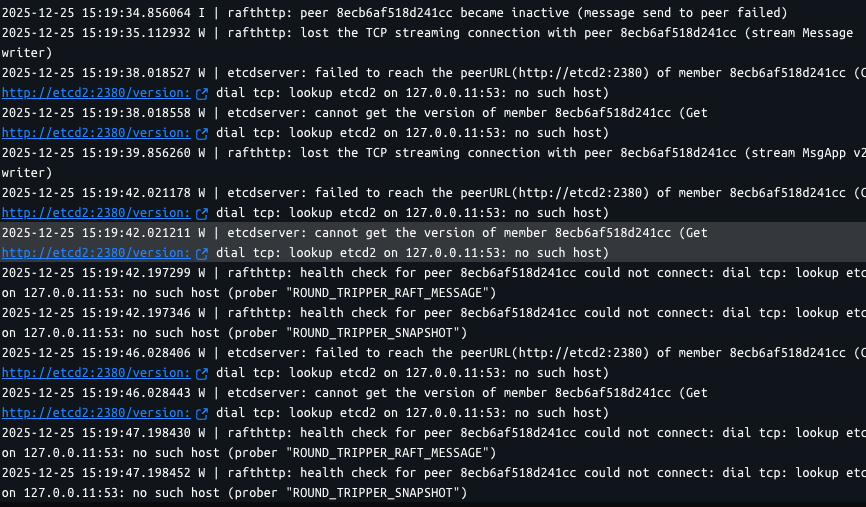
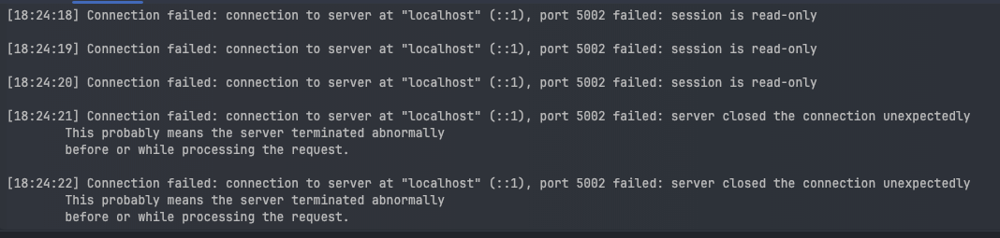
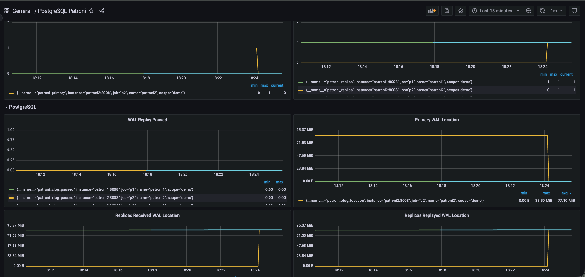
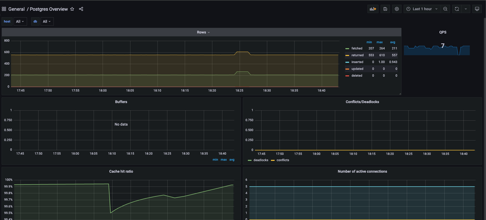

# Решение HW-3
## 1.Сборка, запуск и patronictl list

**Cluster** - логическое объединение нод  
**Member** - отдельная нода кластера  
**Host** - IP-адрес ноды  
**ROLE** - Роль PostgreSQL ноды (leader - RW, replica - RO)  
**State** - *running* - нода активна, *streaming* - реплика успешно получает WAL от лидера  
**TL** - Номер timeline, увеличивается при failover  
**Lag** - отставание реплики от лидера (в идеале - 0)   
## 2. HAProxy

Frontend - принимает клиентские подключения  
Backend:
+ Для лидера - выполняет RW запросы, UP - ровно одна активная нода
+ Для реплик - выполняют RO запросы, UP - все ноды кроме лидерской  
Кроме того, указано количество данных, которые перегоняются через ноду, время жизни и тд.
## 3. Нагрузочное тестирование
  
Пишем данные только в master Postgres, а вот читать можем из всех реплик (в том числе и из мастера)  
### 1. Убиваем patroni
Сделаем немного жести и убьем сразу лидера (контейнер 3)

```bash
[18:08:58] CONNECTION LOST (Failover in progress?): terminating connection due to administrator command
server closed the connection unexpectedly
        This probably means the server terminated abnormally
        before or while processing the request.

[18:09:11] Connection failed: connection to server at "localhost" (::1), port 5002 failed: server closed the connection unexpectedly
        This probably means the server terminated abnormally
        before or while processing the request.
```
  
Убьем второй patroni (кстати он тоже был лидером) - вновь failover, кратковременная ошибка (хотя у меня на самом деле все поломалось, перезапуск стреялки помог).  
Убьем третий patroni - вот мы и убили кластер  
Вывод: для patroni не нужен кворум, поэтому даже одной ноды уже хватит для работы
  
На графике видны все мучения нашего кластера
### 2. Убиваем etcd
Вернем убитые контейнеры с patroni и убьем etcd
  
От одного упавшего etcd наше приложение даже не шелохнулось (кворум все еще есть, никаких проблем).
Попробуем лишить кластер двух нод etcd
  
Вот тут у нас начались проблемы - сначала сессия стала только ридонли, а вот потом (можно посмотреть на графиках ниже)
у нас самоустранился лидер и все стало совсем плохо. Записывать данные в БД мы больше не можем
  
Однако стоит оживить etcd - сразу все возвращается в норму
### 3. Убиваем haproxy
```bash
18:41:19] Connection failed: connection to server at "localhost" (::1), port 5002 failed: Connection refused
        Is the server running on that host and accepting TCP/IP connections?
connection to server at "localhost" (127.0.0.1), port 5002 failed: Connection refused
        Is the server running on that host and accepting TCP/IP connections?

[18:41:20] Connection failed: connection to server at "localhost" (::1), port 5002 failed: Connection refused
        Is the server running on that host and accepting TCP/IP connections?
connection to server at "localhost" (127.0.0.1), port 5002 failed: Connection refused
        Is the server running on that host and accepting TCP/IP connections?

[18:41:21] Connection failed: connection to server at "localhost" (::1), port 5002 failed: Connection refused
        Is the server running on that host and accepting TCP/IP connections?
connection to server at "localhost" (127.0.0.1), port 5002 failed: Connection refused
        Is the server running on that host and accepting TCP/IP connections?
```
Вот она - единая точка отказа. Убили HAProxy и наше приложение не работает, так как мы потеряли "точку входа".  
Внутри все хорошо, etcd и patroni работают, Postgres тоже живой, но никто из них не имеет связи со внешним миром.  
Опять же, стоит восстановить работу HAProxy - и все отлично.

На графике видно, как упал QPS, когда мы роняли HAProxy. При этом все остальное без изменений.  
В проде конечно стоит иметь несколько инстансов HAProxy и балансировщик, чтобы не возникла SPOF