## HW 3 solution

Как и в прошлой домашке, сабмодуль не подтянулся. Я добавил сабмодуль, собрал образ patroni из Dockerfile.

### patronictl

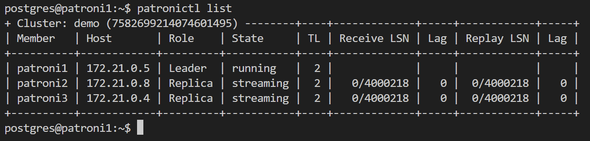

Имеем кластер demo и 3 ноды в нём.
patroni1 - лидер, patroni2, patroni3 - реплики, о чём они активно пишут в лог:

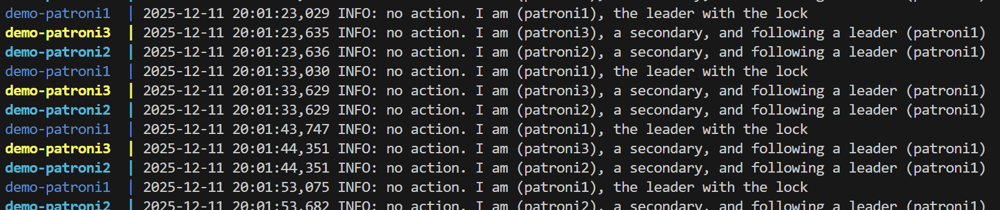

Соответственно postgresql в контейнере patroni1 работает как мастер, а в двух других контейнерах - как слейвы, получают обновления от мастера.

Также в таблице видим IP-адреса нод patroni, их статус (running - для лидера, streaming - чтение потока WAL), TL - количество failover, LSN - количество полученных позиций WAL (receive LSN) и применённых позиций WAL (replay LSN), Lag - соответственно отставание от мастера.

### HAProxy stats

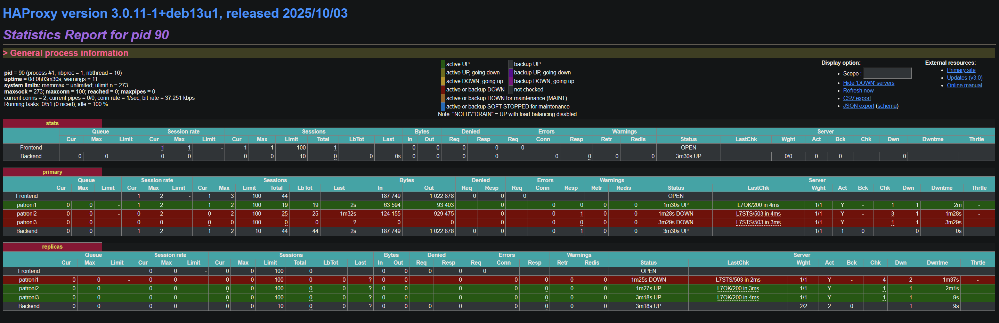

Видим, что у фронтенда статус OPEN - ошибок нет.

В primary списке активен patroni1 - его же ранее мы видели лидером кластера. У него у единственного состояние UP для этого пула.

В пуле реплик, наоборот, patroni2 и patroni3 являются активными.

### Тесты

После создания необходимых таблиц, запустил скрипт, создающий нагрузку:

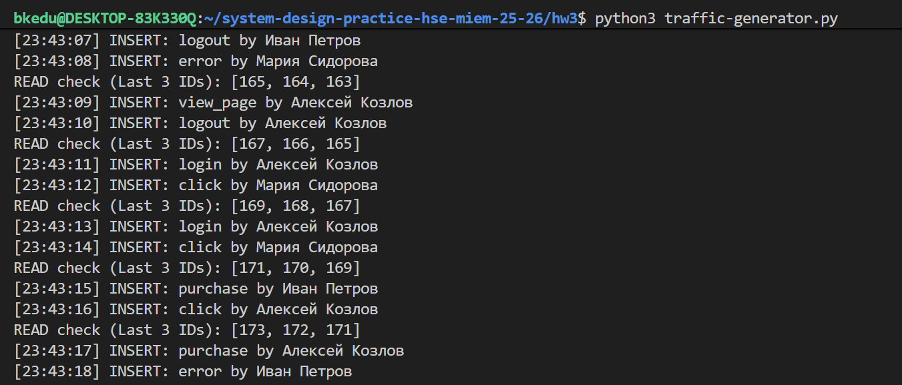

При этом в haproxy status вижу странную картину:

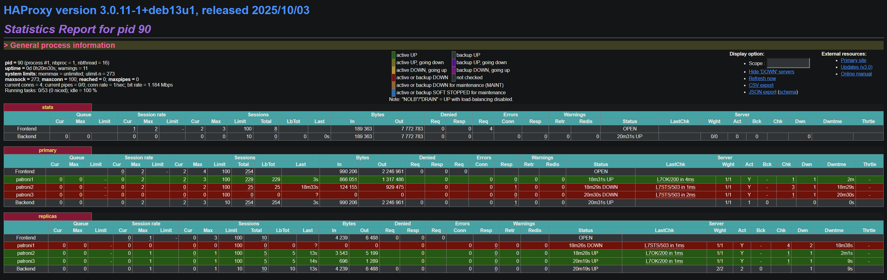

Нагрузка на чтение также идёт на patroni1 (который является лидером). Мне так показалось, потому что только у него растёт количество bytes out.

Попробуем выключить его. patroni3 становится новым лидером:

Спустя некоторое время patroni1 получает статус `active UP, going down`:

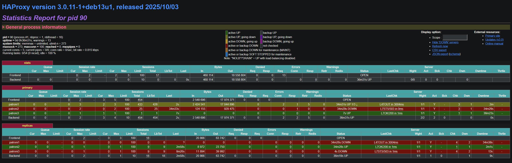

При этом в скрипте получаем ошибку подключения и повторное подключение (но уже к новому лидеру):

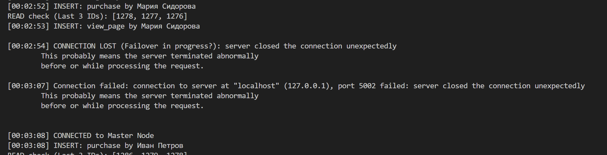

patroni1 вовсе пропадает из списка хостов:

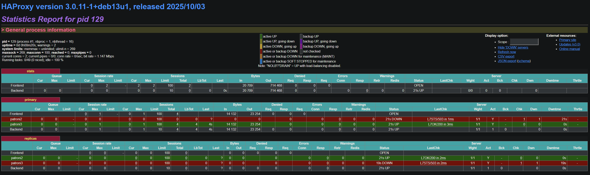

В patronictl также видно обновлённое состояние кластера:

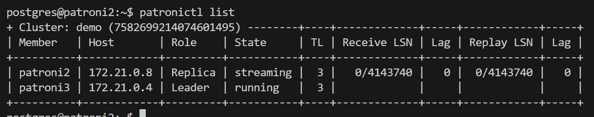

Аналогично можно выключить patroni3:

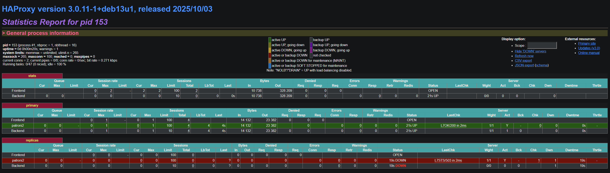

Скрипт продолжает работать после переподключения к новому лидеру:

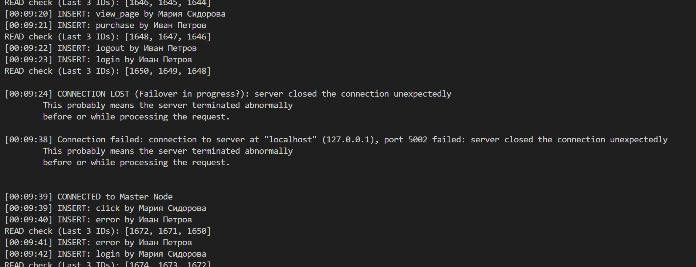

Если вернуть две выключенные ноды обратно, они будут в ожидаемом статусе реплик:

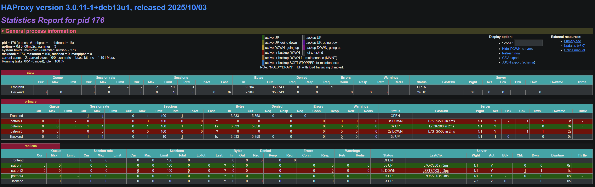

В patronictl статус также корректный:

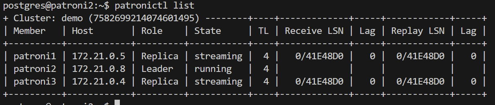

Выключение etcd влияет на кластер только если ушло 2+ ноды. В таком случае не собирается кворум и кластер разваливается, все ноды уходят в статус реплики и не позволяют открыть сессию на запись:

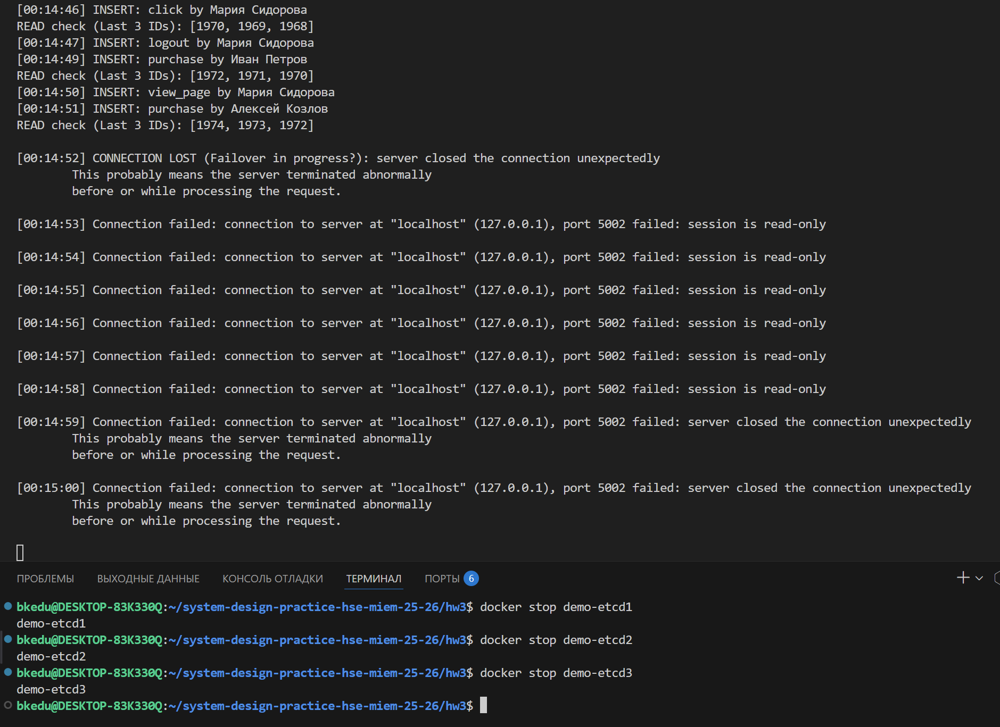
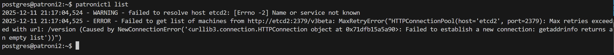

Таким образом, в нашей схеме даже если выключается лидер кластера, приложение продолжает работать. Выбирается новый лидер, приложение переподключается к уже другой базе и продолжает работу. Если выключить нового лидера, мы всё так же продолжим жить. Выключение реплик вообще не влияет на нас (так как почему-то все чтения идут к лидеру).

В нашей архитектуре узким местом является HAProxy. Он запущен в единственном экземпляре, и если он сложится - не достучимся никуда, даже если базы живые. Исправить это можно запуском нескольких реплик, и балансировкой, например, на уровне DNS (указать несколько A-записей, и в случае выхода из строя одного инстанса, будет выбираться другой).

Также может сложиться кластер etcd. Если выбывают 2 из 3 реплик, то, даже если все базы живые, они все уйдут в статус replica. Если поднять количество запущенных etcd до 5 или до 7, кластер станет отказоустойчивее.
